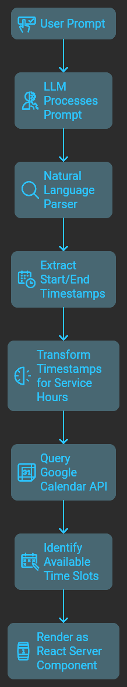

[🇺🇲 English Version](README.md)  
<br />
Este es un proyecto de [Next.js](https://nextjs.org) inicializado con [`create-next-app`](https://nextjs.org/docs/app/api-reference/cli/create-next-app), con soporte adicional para [SST](https://sst.dev/docs/start/aws/nextjs).

### Inicializar SST con AWS

Para configurar SST, usa el siguiente comando:

```bash
pnpm dlx sst@latest init
```

Para usar SST con AWS, asegúrate de que tus credenciales de AWS estén configuradas:

```bash
[default]
aws_access_key_id=XXXXXXXXXXXXX
aws_secret_access_key=XXXXXXXXXXXXXXXXXXXXXXXXXX
```

Elegí SST principalmente por su manejo simplificado de [secrets](https://sst.dev/docs/component/secret), lo que permite una gestión segura sin depender de archivos `.env`. Sin embargo, el uso de variables de entorno sigue siendo una opción si se prefiere.

### Ver demo (video en Loom)

`ctrl + click` para ver el demo  
[Video en Loom](https://www.loom.com/share/a339404a5b61498397e6a22fa5faa67d?sid=eba6a173-9f03-486a-ac3f-e7397235af73)

## Requisitos

1. **OpenAI API Key**
2. **Anthropic API Key (opcional)**: Encontré que Langchain LCEL funciona ligeramente mejor con modelos como `claude-3-5...`, aunque un solo modelo podría ser suficiente.
3. **Service Account de Google Calendar**: Esto debería estar en formato JSON, como [`service-account.keys.example.json`](service-account.keys.example.json), y se puede obtener a través de la Google Cloud Console.

## Generative UI con el [AI SDK RSC](https://sdk.vercel.ai/docs/ai-sdk-rsc/overview) de Vercel

El paquete AI SDK RSC de Vercel, lanzado recientemente, me llamó la atención como desarrollador de Next.js. Este proyecto demuestra un caso de uso en el que un LLM, equipado con una herramienta personalizada, puede renderizar una respuesta como un React Server Component en lugar de solo texto. Aquí hay un poco de contexto de la [documentación de Vercel](https://sdk.vercel.ai/docs/ai-sdk-rsc/overview):

> Los React Server Components (RSC) permiten renderizar la interfaz en el servidor y transmitirla al cliente. Introducen Server Actions, permitiendo llamadas de funciones del lado del servidor desde el cliente con seguridad de tipo de extremo a extremo. Esto abre nuevas posibilidades para aplicaciones de IA, donde un LLM puede generar y transmitir componentes de interfaz de usuario directamente del servidor al cliente.

### Cómo Funciona Esto

La funcionalidad central está basada en la función [`streamUI`](https://sdk.vercel.ai/docs/reference/ai-sdk-rsc/stream-ui) del paquete AI SDK RSC. Puedes encontrar su implementacion en  
[`src/app/ai-sdk-rsc-demo/actions.tsx`](src/app/ai-sdk-rsc-demo/actions.tsx).

- **streamUI** acepta varios parámetros, incluyendo:
  - **model**: La instancia de LLM (por ejemplo, la [instancia de OpenAI Model](src/lib/openai-model.ts))
  - **tools**: Funciones personalizadas que incluyen un nombre, descripción y esquema para argumentos, usados en el campo `generate`. Aquí tienes cómo funciona:

1. Definimos una función generadora asíncrona que espera un parámetro `timeReference`. Por ejemplo, si el usuario indica: **"Reservar para mañana a las 4 PM"**, esperamos que el LLM analice y pase `timeReference` como "mañana a las 4PM".
2. Una función personalizada `naturalLangDateParser`, impulsada por el popular paquete [`chrono-node`](https://www.npmjs.com/package/chrono-node), analiza las referencias de tiempo en lenguaje natural y devuelve marcas de tiempo **start** y **end** (por ejemplo, `2024-10-04T00:00:00.000Z`).
   - **start**: Para "mañana a las 4PM" en UTC -6, esto sería `2024-10-05T22:00:00.000Z`.
   - **end**: Se mantiene **null** si no se infiere de la consulta del usuario.
3. Funciones personalizadas adicionales transforman las marcas de tiempo start/end para horas de servicio (por ejemplo, ajustando para disponibilidad de 9 AM a 5 PM). Estas transformaciones son determinísticas y no requieren una llamada al LLM.
4. Con el intervalo start/end, podemos consultar el endpoint [Freebusy:query](https://developers.google.com/calendar/api/v3/reference/freebusy/query) de la API de Google Calendar, que devuelve los tiempos disponibles/ocupados del calendario. Nuestra función personalizada `availableThirtyMinSpots` identifica espacios abiertos de 30 minutos y la fecha específica dentro del intervalo.
5. Finalmente, los datos (espacios disponibles y fecha) se renderizan como un React Server Component personalizado, y esto es lo que marca la diferencia, haciendo que  
   el LLM responda con UI en lugar de texto plano (a través de la herramienta):

```typescript
return <DayAvailableTimes day={day} availableTimes={freeSpots} />;
```

<p content="left">


</p>

## Generative UI con el [AI SDK UI](https://sdk.vercel.ai/docs/ai-sdk-ui) de Vercel

El [AI SDK RSC](https://sdk.vercel.ai/docs/ai-sdk-rsc/overview) está actualmente en fase experimental.  
Vercel recomienda usar el [AI SDK UI](https://sdk.vercel.ai/docs/ai-sdk-ui/overview) para producción.  
Puedes revisar la [Guía de Migración](https://sdk.vercel.ai/docs/ai-sdk-rsc/migrating-to-ui) para más detalles.

He creado un segmento de ruta para la migración a AI SDK UI en [`ai-sdk-ui-demo`](src/app/ai-sdk-ui-demo).  
Los cambios principales incluyen:

1. Reemplazar la server action con un route handler: [`api/chat/route.ts`](src/app/api/chat/route.ts)
2. Usar la función [`streamText`](https://sdk.vercel.ai/docs/ai-sdk-core/generating-text#streamtext) de AI SDK UI de Vercel para transmitir propiedades directamente al cliente.
3. En el cliente, usar `useChat` de AI SDK UI para obtener la respuesta en streaming de la ruta API.  
   `useChat` decodifica el flujo en `toolInvocations` y renderiza la interfaz de chat. `toolInvocations` nos permite filtrar por _toolName_ para pasar las propiedades al componente adecuado:

```tsx
...
{
  message.toolInvocations?.map((toolInvocation) => {
    const { toolName, toolCallId, state } = toolInvocation;
    if (state === 'result') {
      if (toolName === 'showBookingOptions') {
        const { result } = toolInvocation;
        return (
          <div key={toolCallId}>
            <DayAvailableTimes {...result} />
          </div>
        );
      }
    } else {
      return (
        <div key={toolCallId}>
          {toolName === 'showBookingOptions' ? <AvailableTimesSkeleton /> : null}
        </div>
      );
    }
  }) ?? null;
}
...
```

Desde aquí, todo fluye sin problemas.  
**La belleza de este enfoque es que no necesita soporte a nivel de framework para React Server Components**,  
así que puedes implementarlo fuera de Next.js si es lo que prefieres, y la experiencia es prácticamente la misma.

## Generative UI con Técnica de Chain-of-Thought Prompting

En los enfoques anteriores, aprovechamos los LLMs para extraer una referencia de fecha y hora.  
Por ejemplo, si un usuario solicita: **"Reservar para mañana a las 4 PM"**, esperamos que el LLM extraiga  
**"mañana a las 4 PM"** como referencia de fecha y hora. Esta referencia se pasa luego a una herramienta personalizada  
que el LLM llama cuando es necesario.

Los primeros dos enfoques analizan la referencia de fecha y hora de manera "determinista", utilizando  
el paquete npm [chrono-node](https://github.com/wanasit/chrono) para extraer tanto las marcas de tiempo **start** como **end**.  
Estas marcas de tiempo son esenciales para crear (insertar) eventos con la [Google Calendar API](https://developers.google.com/calendar/api/v3/reference/events/insert).  
Inicialmente creé este demo para un taller, y al presentarlo por primera vez,  
un asistente me preguntó por qué no había pedido al LLM extraer directamente las marcas de tiempo.  
La pregunta me intrigó, así que decidí intentarlo y esto fue lo que se me ocurrió.

El tercer enfoque, que encontrarás en el segmento de ruta [`ai-sdk-cot-prompt`](src/app/ai-sdk-cot-prompt),  
es similar al segundo (AI SDK UI). Sin embargo, en lugar de llamar a una función de utilidad `naturalLangDateParser`,  
diseñé una [Langchain chain (LCEL)](https://js.langchain.com/docs/con
