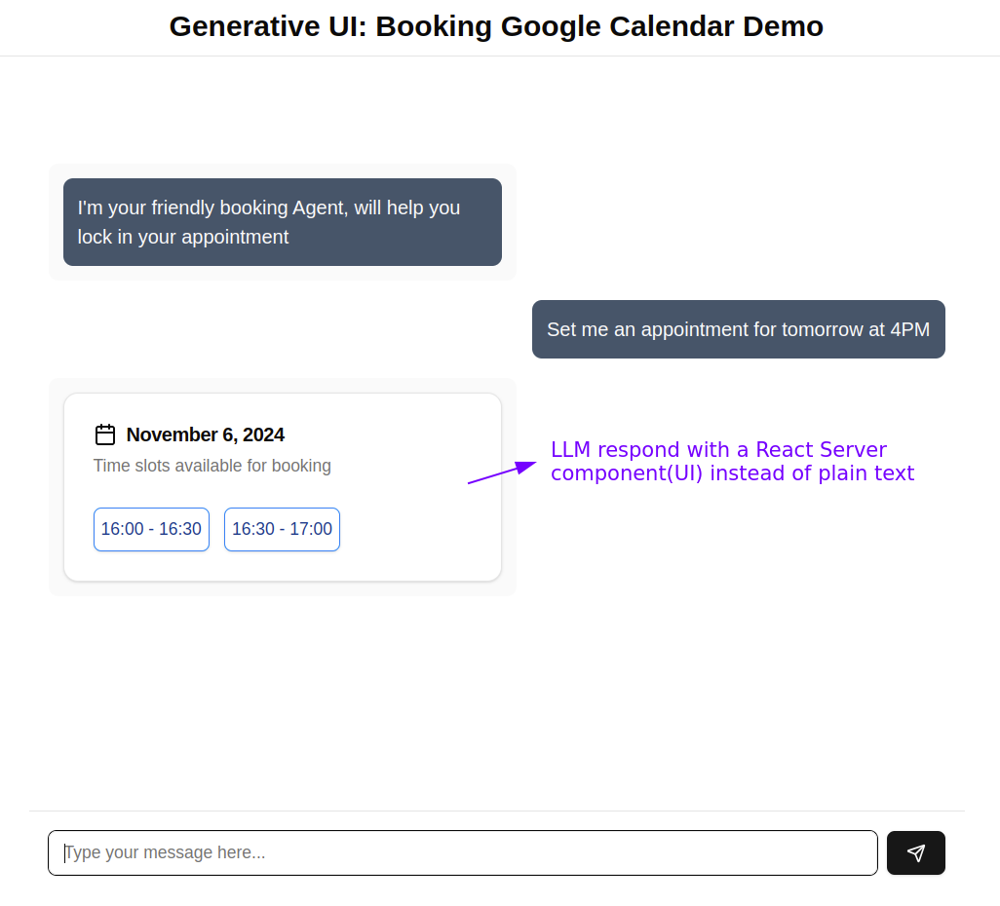
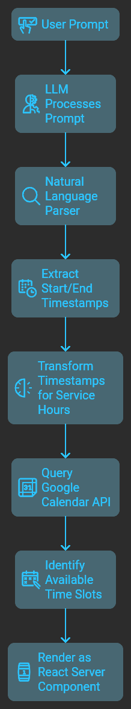

[🇪🇸 Version en Español](README.es.md)  
<br />
This is a [Next.js](https://nextjs.org) project bootstrapped with [`create-next-app`](https://nextjs.org/docs/app/api-reference/cli/create-next-app), with added support for [SST](https://sst.dev/docs/start/aws/nextjs).

### Initialize SST with AWS

To set up SST, use the following command:

```bash
pnpm dlx sst@latest init
```

To use SST with AWS, ensure your AWS credentials are configured:

```bash
[default]
aws_access_key_id=XXXXXXXXXXXXX
aws_secret_access_key=XXXXXXXXXXXXXXXXXXXXXXXXXX
```

I chose SST primarily for its streamlined management of [secrets](https://sst.dev/docs/component/secret), enabling secure handling without relying on `.env` files. However, using environment variables is still an option if preferred.

### Check demo(Loom video)

`ctrl + click` to watch demo  
[Loom video](https://www.loom.com/share/a339404a5b61498397e6a22fa5faa67d?sid=eba6a173-9f03-486a-ac3f-e7397235af73)

## Requirements

1. **OpenAI Secret Key**
2. **Anthropic Secret Key (Optional)**: I find Langchain LCEL works slightly better with models like `claude-3-5...`, though a single model could suffice.
3. **Google Calendar Service Account**: This should be in a JSON file format like [`service-account.keys.example.json`](service-account.keys.example.json), obtainable through the Google Cloud Console.

## Generative UI with Vercel's [AI SDK RSC](https://sdk.vercel.ai/docs/ai-sdk-rsc/overview)

Vercel's AI SDK RSC package, released earlier this year, caught my attention as a Next.js developer. This project demonstrates a use case where an LLM, when equipped with a custom tool, can render a response as a React Server Component instead of plain text. Here’s some context from [Vercel's documentation](https://sdk.vercel.ai/docs/ai-sdk-rsc/overview):

> React Server Components (RSC) enable UI rendering on the server, streaming to the client. They introduce Server Actions, allowing server-side function calls from the client with end-to-end type safety. This opens new possibilities for AI applications, where an LLM can generate and stream UI components directly from the server to the client.

### How This Works

The core functionality is driven by the [`streamUI`](https://sdk.vercel.ai/docs/reference/ai-sdk-rsc/stream-ui) function from the AI SDK RSC package. You can find its usage in [`src/app/ai-sdk-rsc-demo/actions.tsx`](src/app/ai-sdk-rsc-demo/actions.tsx).

- **streamUI** accepts various parameters, including:
  - **model**: The LLM instance (e.g., the [OpenAI instance](src/lib/openai-model.ts))
  - **tools**: Custom functions that include a name, description, and schema for arguments, used in the `generate` field. Here’s how it works:

1. We define an async generator function that expects a `timeReference` parameter. For instance, if the user prompts: **"Book me for tomorrow at 4 PM"**, we expect the LLM to parse and pass `timeReference` as "tomorrow at 4PM."
2. A custom function `naturalLangDateParser`, powered by the popular [`chrono-node`](https://www.npmjs.com/package/chrono-node) package, parses natural language time references and returns **start** and **end** timestamps (e.g., `2024-10-04T00:00:00.000Z`).
   - **start**: For "tomorrow at 4PM" in UTC -6, this would be `2024-10-05T22:00:00.000Z`.
   - **end**: Remains **null** if not inferred from the user query.
3. Additional custom functions transform the start/end timestamps for service hours (e.g., adjusting for 9 AM to 5 PM availability). These transformations are deterministic and don’t require an LLM call.
4. With the start/end interval, we can query the [Google Calendar API](https://developers.google.com/calendar/api/v3/reference/freebusy/query) **Freebusy:query** endpoint, which returns free/busy times for the calendar. Our custom `availableThirtyMinSpots` function identifies 30-minute open slots and the specific date within the interval.
5. Finally, the data (available slots and date) is rendered as a custom React Server Component, and this is the differentiator, we make  
   the LLM respond with UI instead of plain text(via tool);

```typescript
return <DayAvailableTimes day={day} availableTimes={freeSpots} />;
```

<p content="left">


</p>

## Generative UI with Vercel's [AI SDK UI](https://sdk.vercel.ai/docs/ai-sdk-ui)

The [AI SDK RSC](https://sdk.vercel.ai/docs/ai-sdk-rsc/overview) is currently experimental.  
Vercel recommends using [AI SDK UI](https://sdk.vercel.ai/docs/ai-sdk-ui/overview) for production.  
You can check the [Migration Guide](https://sdk.vercel.ai/docs/ai-sdk-rsc/migrating-to-ui) for more details.

I created a route segment for migrating to AI SDK UI in [`ai-sdk-ui-demo`](src/app/ai-sdk-ui-demo).  
The main changes include:

1. Replacing the server action with a route handler: [`api/chat/route.ts`](src/app/api/chat/route.ts)
2. Using Vercel's AI SDK UI [`streamText`](https://sdk.vercel.ai/docs/ai-sdk-core/generating-text#streamtext) function to stream props directly to the client.
3. On the client side, utilizing AI SDK UI's [`useChat`](https://sdk.vercel.ai/docs/reference/ai-sdk-ui/use-chat) to get the streamed response from the API route.  
   `useChat` decodes the stream into `toolInvocations` and renders the chat interface. `toolInvocations` allows us to filter by _toolName_ so we can pass the props into the appropriate component:

```tsx
...
{
  message.toolInvocations?.map((toolInvocation) => {
    const { toolName, toolCallId, state } = toolInvocation;
    if (state === 'result') {
      if (toolName === 'showBookingOptions') {
        const { result } = toolInvocation;
        return (
          <div key={toolCallId}>
            <DayAvailableTimes {...result} />
          </div>
        );
      }
    } else {
      return (
        <div key={toolCallId}>
          {toolName === 'showBookingOptions' ? <AvailableTimesSkeleton /> : null}
        </div>
      );
    }
  }) ?? null;
}
...
```

From here, it’s pretty much smooth sailing.  
**The beauty of this approach is that it doesn’t need framework-level support for React Server Components**,  
so you’re free to roll with it outside of Next.js if that’s your thing, and the experience is almost the same

## Generative UI with Chain-of-Thought Prompting Technique

In the previous approaches, we leveraged LLMs to extract a date-time reference.  
For example, if a user prompts: **"Book me for tomorrow at 4 PM"**, we expect the LLM to extract  
**"tomorrow at 4 PM"** as a date-time reference. This reference is then passed to a custom tool  
that the LLM calls when needed.

The first two approaches parse the date-time reference in a "deterministic" way, using  
the [chrono-node](https://github.com/wanasit/chrono) npm package to extract both **start** and **end** timestamps.  
These timestamps are essential for creating (inserting) events with the [Google Calendar API](https://developers.google.com/calendar/api/v3/reference/events/insert).  
I initially created this demo for a workshop, and when presenting it for the first time,  
an attendee asked why I hadn't prompted the LLM to directly extract the timestamps.  
The question intrigued me, so I decided to try it and this is what I came up with.

The third approach, which you’ll find linked to the [`ai-sdk-cot-prompt`](src/app/ai-sdk-cot-prompt) route segment,  
is similar to the second one (AI SDK UI). However, instead of calling a `naturalLangDateParser` utility function,  
I crafted a [Langchain chain (LCEL)](https://js.langchain.com/docs/concepts/lcel) as a utility function:  
[`extractDateTimeInterval`](src/utils/langchain-chains.ts).  
This function leverages Langchain's chaining syntax to process the query:

```ts
export async function extractDateTimeInterval(query: string) {
  const response = await intervalPromptTemplate
    .pipe(model)
    .pipe(outputParser)
    .invoke({
      userQuery: query,
      currentTimeStamp: utcToLocaleTimeZone(new Date().toISOString())
    });
  return response;
}
```

If you're not too familiar with LCEL syntax, the code above starts with a prompt template.  
This template
includes some variables that are passed when **invoke** is called.

The real highlight of this approach is the design of the prompt template itself.  
Here, we provide the LLM
with a highly descriptive, step-by-step explanation or reasoning process to reach the final answer.  
You can find the prompt template [here](src/utils/prompts.ts).

As a note, I found that this chain seems to work a bit better with
[Anthropic's claude-3-5-sonnet-20240620](src/lib/anthropic-model.ts),  
which is why an Anthropic API key is required.
However, it also works well(IMO) with other LLM vendors if you'd prefer a single LLM integration.
